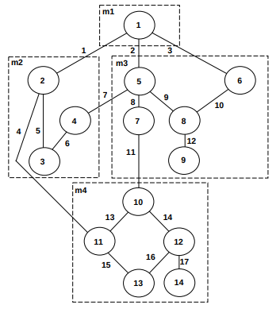
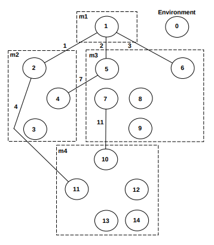
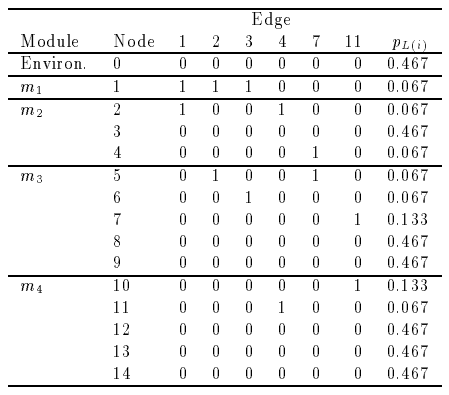

# Rusty CATS

[Another go at this](https://github.com/ThomWright/cats)

## Definitions

- _MS_ - Modular system, represented as a graph
- _S_ - a subgraph with n+1 nodes, including 1 for the environment (disconnected)
- _ns_ - number of distinct labels (each node is labelled with the set of connected edges)
- _pl_ - proportions of distinct labels
- _pL(i)_ - proportion of a node _i_'s distinct label set (relative to total number of nodes)
- _Entropy_ - average information per node
- _Intermodule coupling_ - minimum description length of the relationships in _S_ where _S_ is a subgraph with intermodule edges only
- _Intramodule coupling_ - minimum description length of the relationships in _S'_ where _S'_ is a subgraph with intramodule edges only
- _Cohesion_ - intramodule coupling / maximum intramodule coupling (all nodes connected)

## Equations

### Entropy of the distribution of node labels

_H(S) = Σ(-pl log pl)_
 from _l=1_ to _ns_

_H(S) = Σ(1/(n+1))(-log pL(i))_
 from _i=0_ to _n_

## Examples

All diagrams from [1].

### Intermodule coupling

This is an example of intermodule coupling. All intramodule edges have been removed.

Node 3 has _pL(i)_ of 0.467 because there are 7 nodes with the same distinct label set, and 15 nodes total: 7/15 = 0.467.

## Reference material

- [1] [Measuring Coupling and Cohesion: An Information-Theory Approach](http://www.sdml.cs.kent.edu/library/Allen99.pdf)
- [2] [Experiments with Coupling and Cohesion Metricsin a Large System](http://www.csi.uottawa.ca/~tcl/papers/metrics/ExpWithCouplingCohesion.pdf)
- [3] [Quantitative models of cohesion and coupling in software](http://citeseerx.ist.psu.edu/viewdoc/download?doi=10.1.1.94.183&rep=rep1&type=pdf)
